<div align="center">
  
</div>

# shellcode-gen

> Red team security tool — authorized use only.

```bash
python shellcode_gen.py --help
```

> **Authorized security testing only.**

**Omar Khalid** — [omareldemery.com](https://omareldemery.com)
